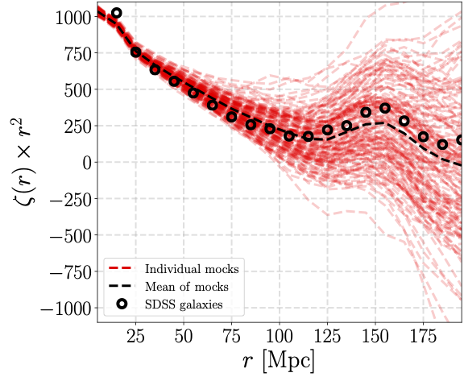

# GRAMSCI

**GRA**ph **M**ade **S**tatistics for **C**osmological **I**nformation — fast
**2-, 3- and 4-point correlation functions** (including the parity-odd 4PCF) of
3D point sets, built on a graph-database representation of the pair graph.


[](https://github.com/csabiu/Gramsci/actions/workflows/ci.yml)
[](COPYING)
[](https://arxiv.org/abs/1901.00296)


GRAMSCI measures the N-point correlation functions of a 3D catalogue (a galaxy
survey, a simulation box, …).  It builds a KD-tree, stores each point's
neighbours within `rmax` as a compact adjacency graph, and then counts N-point
configurations **directly from the graph** — the design principle that makes it
fast and memory-light.

- **2PCF** (with optional μ bins), full **3PCF** (all triangles) + equilateral,
  full **4PCF**, and the **parity-odd 4PCF**.
- Runs on **CPU** (OpenMP), **any GPU via OpenCL** (incl. Apple Silicon), or
  **NVIDIA GPUs via OpenACC** — same command-line interface and outputs.
- A **Python API** that takes NumPy arrays, plus a command-line tool.

> Sabiu, Hoyle, Kim & Li, *ApJS* **242**, 29 (2019),
> [arXiv:1901.00296](https://arxiv.org/abs/1901.00296),
> Sabiu *ApJS* _under_ _review_ (2026),
> [arXiv:2607.06604](https://arxiv.org/abs/2607.06604).
> Please cite if you use
> GRAMSCI — see [Citation](#citation).

---

## Why the name?

At Antonio Gramsci's 1928 trial, the Fascist prosecutor demanded:
*"For twenty years we must stop this brain from working."* The brain kept
working — some 3,000 pages' worth of the
[*Prison Notebooks*](https://en.wikipedia.org/wiki/Prison_Notebooks).
This code is named in the same spirit: the interesting signal is the one everyone declared too expensive
to compute.

Gramsci is best remembered for the theory of *cultural hegemony* — the way a
dominant order persists not by force but by being mistaken for common sense.
Cosmology has its own: a century of the two-point correlation function.
GRAMSCI is the counter-hegemonic program — patient organisation of the
triplets and quadruplets.

---

## Install

Needs a Fortran compiler with OpenMP (`gfortran`). On macOS: `brew install gcc`.
On macOS the build auto-detects the SDK for the linker.

```sh
git clone <repo-url> gramsci && cd gramsci
make                    # builds bin/gramsci
pip install -e python   # optional: the Python interface (needs numpy)
```

Optional GPU builds — identical CLI and output formats:

```sh
make gpu    # portable OpenCL  -> bin/gramsci_cl   (Apple Silicon / AMD / Intel; see src_opencl/)
make cuda   # NVIDIA OpenACC   -> bin/gramsci_gpu  (needs nvfortran;            see src_gpu/)
```

## Quickstart — Python

```python
import numpy as np
import gramsci

data = ...     # (N, 3) array of x, y, z in comoving Mpc/h
wd   = ...     # (N,)   per-object weights
rand = ...     # (M, 3) random catalogue covering the same volume
wr   = ...     # (M,)   random weights

# --- 2-point correlation function ---
xi = gramsci.compute_2pcf(data, wd, rand, wr, rmin=1, rmax=150, nbins=30)
#   xi.r, xi.xi, xi.NN, xi.RR

# --- 3-point correlation function (all triangle configurations) ---
z = gramsci.compute_3pcf(data, wd, rand, wr, rmin=20, rmax=140, nbins=10)
#   one row per (r1, r2, r3) triangle:  z.r1, z.r2, z.r3, z.zeta

# --- connected & parity 4PCF ---
q  = gramsci.compute_4pcf(data, wd, rand, wr, rmin=20, rmax=140, nbins=4)               # q.zeta_conn
qp = gramsci.compute_4pcf(data, wd, rand, wr, rmin=20, rmax=140, nbins=4, parity=True)  # qp.zeta_even, qp.zeta_odd

# --- periodic simulation box: no randoms needed ---
# Minimum-image separations + analytic RR/RRR/RRRR (see below)
xi = gramsci.compute_2pcf(data, wd, box=1000.0, rmin=1, rmax=150, nbins=30)
z  = gramsci.compute_3pcf(data, wd, box=1000.0, rmin=20, rmax=140, nbins=10)
q  = gramsci.compute_4pcf(data, wd, box=1000.0, rmin=20, rmax=140, nbins=4)
```

Each call returns a small result object whose attributes are NumPy arrays. Point
it at a GPU build with `binary="bin/gramsci_cl"` or `export GRAMSCI_BIN=...`.

👉 **See [`example/quickstart.ipynb`](example/quickstart.ipynb)** for an
end-to-end tutorial: catalogue → measurement → plot.

## Quickstart — command line

Input catalogues are plain ASCII, 4 columns `x y z weight` (comoving Mpc/h):

```sh
bin/gramsci -gal galaxies.dat -ran randoms.dat \
    -rmin 20 -rmax 140 -nbins 10 -3pcf -out result.3pcf
```

| Flag                | Meaning                                                   |
|---------------------|-----------------------------------------------------------|
| `-gal <file>`       | galaxy/data catalogue (`x y z [weight]`)                  |
| `-ran <file>`       | random catalogue (same format, optional)                 |
| `-out <file>`       | output filename                                          |
| `-rmin` / `-rmax`   | min / max radial separation                              |
| `-nbins <N>`        | number of radial bins                                    |
| `-nmu <N>`          | number of μ bins (anisotropic; default 1 = isotropic)    |
| `-log`              | logarithmic radial binning                               |
| `-version`          | print the version and exit                               |
| `-box <L>`          | periodic box, side L (or `Lx,Ly,Lz`); no `-ran` ⇒ analytic RR |
| `-2pcf`             | 2-point correlation function                             |
| `-3pcf` / `-equi`   | 3PCF (all triangles) / equilateral only                  |
| `-4pcf` / `-4pcfp`  | 4PCF / 4PCF with parity decomposition                    |
| `-ntheta <N>` / `-nphi <M>` | direction-pixel grid for `-4pcfp` (default 8×32, `N*M ≤ 32767`) |
| `-exactparity`      | parity sign from exact positions instead of pixelized directions (recommended: the pixel sign is hub-order dependent for near-coplanar tetrahedra) |
| `-njk <N>`          | delete-one jackknife errors with N regions (all modes; see below) |
| `-jkgal` / `-jkran` | optional external region-label files (one label 1..N per catalogue row) |

Query modes can be **combined** in one run — the KD-tree and neighbor graph
(usually the dominant cost) are built once and every query reuses them. With a
single mode the result goes exactly to `-out`; with several, each mode writes
to `<out>.<mode>`:

```sh
bin/gramsci -gal data.gal -ran data.ran -rmin 5 -rmax 30 -nbins 10 \
            -2pcf -3pcf -4pcf -out result   # -> result.2pcf, result.3pcf, result.4pcf
```

### Periodic boxes — no randoms needed

For a regular geometry such as a periodic simulation box, pass `-box L`
(cubic) or `-box Lx,Ly,Lz` and omit `-ran`:

```sh
bin/gramsci -gal snapshot.dat -box 1000 -rmin 20 -rmax 140 -nbins 10 -3pcf -out result.3pcf
```

Separations then use the **minimum-image convention**, and the random counts
are computed **analytically** instead of from a random catalogue — exactly for
the 2PCF (shell volumes) and 3PCF (triangle kernel), and by deterministic
semi-analytic quadrature for the 4PCF tetrahedron configurations. This removes
both the cost and the shot noise of random catalogues. The estimators become
the natural ones with all lower-order terms subtracted internally, so the
output columns keep their usual meanings (for the 4PCF this includes an
internal 2PCF and 3PCF pass to remove the six edge-ξ and four face-ζ₃ terms
from `zeta`). Requirements: coordinates spanning one box period,
`rmax < L/2` for the 2PCF, `rmax ≤ L/4` for the 3/4PCF, and `-nmu 1`.
Combining `-box` with `-ran` is also allowed: distances are periodic and the
usual catalogue estimators are used.

For **redshift-space data** the 4PCF disconnected (Gaussian) term is
subtracted anisotropically: the internal 2PCF pass also measures the
quadrupole and hexadecapole ξ₂(r), ξ₄(r) (plane-parallel line of sight along
z in a box; midpoint line of sight in survey mode with `-nmu > 1`), and
`zeta_disc` includes the line-of-sight orientation covariance of each edge
pairing, `ξ₀ξ₀ + ξ₂ξ₂L₂(cosθ)/5 + ξ₄ξ₄L₄(cosθ)/9`, with θ the opposite-edge
angle fixed by the bin geometry. For real-space data ξ₂ ≈ ξ₄ ≈ 0 and this
reduces to the usual isotropic product. The parity-odd channel involves no
disconnected term and is unaffected.

### 2PCF Legendre multipoles

Whenever a per-pair μ exists — a periodic box (plane-parallel line of sight
along z) or survey mode with `-nmu > 1` (midpoint line of sight) — `-2pcf`
additionally writes `<out>[.2pcf].mult` with the monopole, quadrupole and
hexadecapole `ξ₀(r), ξ₂(r), ξ₄(r)`, computed from exact per-pair Legendre
sums accumulated during graph construction (no μ-binning error).  In
particular `-box` alone gives simulators the redshift-space quadrupole
directly.  The Python wrapper exposes them as `result.xi0/xi2/xi4`.

### Jackknife errors — internal angular regions

> Gramsci's motto: *pessimism of the intellect, optimism of the will.*
> Error analysis in the same spirit: pessimism of the covariance,
> optimism of the χ².

`-njk N` switches on **delete-one jackknife** error estimation for every
query mode, up to and including the parity-odd 4PCF:

```sh
bin/gramsci -gal data.gal -ran data.ran -rmin 20 -rmax 140 -nbins 10 \
            -2pcf -3pcf -4pcfp -njk 50 -out result
```

By default the regions are constructed **internally, on the sky only**: the
directions of the points as seen from the observer at the origin are cut into
`~√N` bands of sin(dec) at equal-count quantiles, and each band into φ slices
at equal-count quantiles, giving N regions of near-equal random counts.
Boundaries are computed from the random catalogue (it traces the angular
selection with the lowest shot noise) and applied identically to data and
randoms. The partition is deliberately **angular-only** — a deleted region
removes a full line-of-sight cone — because angular and radial variations
have different systematic sources in real data (masking, seeing, stellar
contamination vs redshift errors and radial selection), and a partition that
mixed them would conflate the two in the error estimate. The labels used are
written to `<out>.jkgal` / `<out>.jkran`, in exactly the format that
`-jkgal <file>` / `-jkran <file>` read back, so a partition can be re-used,
inspected, or replaced with your own (e.g. survey-specific) regions.

All N realisations are accumulated in the **single normal query pass**: a
tuple contributes to realisation m unless one of its points lies in region m,
so `N_m = N_total − N_touching(m)` with no extra passes over the graph. Each
mode writes two extra files:

- `<out>[.<mode>].jk` — the N delete-one realisations per bin
  (`NN/RR/xi`, `NNN/RRR/zeta`, `NNNN/RRRR/zeta[_even/_odd]/zeta_disc/zeta_conn`);
- `<out>[.<mode>].jkerr` — the jackknife mean and error per bin,
  `σ² = (N−1)/N Σₘ (ζₘ − ζ̄)²`;
- `<out>[.<mode>].jkcov` — the full jackknife **covariance matrix** of the
  mode's primary estimator (row order matching the main output; the parity
  4PCF also writes `.jkcov_odd` for the odd channel, and the 4PCF matrices
  are skipped above 1000 configurations — build them from the realisations
  instead).  The stored matrix is the **raw** covariance: apply the Hartlap
  factor `(N − n_bins − 2)/(N − 1)` when inverting, or use the Python
  `result.jk_inverse_covariance()`, which applies it by default.

For the 4PCF the disconnected term is rebuilt per realisation from the
jackknifed internal 2PCF ξ₀ (the RSD multipoles ξ₂/ξ₄ stay at their
full-sample values); the parity-odd channel needs no disconnected
subtraction, so `zeta_conn_odd = zeta_odd` realisation by realisation.
Requirements: a random catalogue (`-ran`) and `N ≥ 2`; the internal angular
partition is refused in `-box` mode (a periodic box has no observer
direction — supply `-jkgal`/`-jkran` if you really want box jackknife).
The Python wrapper exposes the same thing via `njk=`:
`compute_2pcf(..., njk=50).xi_jk_sigma`,
`compute_4pcf(..., parity=True, njk=50).zeta_odd_jk_sigma`, with the raw
realisation table in `.jk_real`, `result.jk_covariance(column)` for the
covariance of any estimator column, and
`result.jk_inverse_covariance(column)` for the likelihood-ready
Hartlap-corrected inverse.

## Output

Every output file is whitespace-delimited with a one-line header; the bin edges
come first, then counts and the estimator. The Python wrapper unpacks them:

| Mode    | Key columns (Python attributes)                                  |
|---------|------------------------------------------------------------------|
| `-2pcf` | `r`, `NN`, `RR`, `xi`                                             |
| `-3pcf` | `r1`, `r2`, `r3`, `NNN`, `RRR`, `zeta`                            |
| `-4pcf` | 6 side bins, `NNNN`, `RRRR`, `zeta`, `zeta_disc`, `zeta_conn`     |
| `-4pcfp`| … plus `zeta_even`, `NNNN_odd`, `RRRR_odd`, `zeta_odd`            |

## The 3pcf at the BAO scale 

<p align="center">
  
</p>

[From Sabiu et. al. 2019]

## How it works

GRAMSCI runs in two phases:

1. **Graph construction.** A KD-tree is built from the points; for each point all
   neighbours within `rmax` are found and stored as an adjacency list. Pairwise
   distances are binned at this stage, so the graph stores integer bin indices
   rather than floating-point distances. The KD-tree and coordinates are then
   freed.
2. **Graph query.** All N-point counting is done from the adjacency lists alone,
   without the original coordinates — a compact, cache-friendly structure
   optimised for combinatorial enumeration.

For the parity 4PCF, each edge also stores a two-byte "direction pixel" encoding
the displacement direction, enabling chirality classification without retaining
coordinates. The grid defaults to 8×32 pixels and is set with `-ntheta`/`-nphi`.
A coarser grid attenuates the recovered parity-odd amplitude for tetrahedra whose
three spoke directions are nearly coplanar (measured: ~13% and ~9% loss for the
most degenerate shapes on the 4×16 grid used before v2.1, gone by 8×32) and
discards more of those whose pixelized volume is exactly zero (6.8% of tetrahedra
at 4×16 against 1.4% at 8×32 and 0.12% at 23×91). Alternatively `-exactparity` evaluates the signed volume directly from
the galaxy positions: no attenuation, nothing discarded, and no per-edge index at
all — the graph reverts to 5 bytes/edge and 24 bytes/point of coordinates are
kept instead, a net saving of roughly a quarter of a DESI-sized parity graph, for
~8% more query time.

## GPU builds

| Build           | Directory     | Precision | Hardware                              |
|-----------------|---------------|-----------|---------------------------------------|
| `gramsci`       | `src/`        | double    | CPU (OpenMP)                          |
| `gramsci_cl`    | `src_opencl/` | single    | Any OpenCL 1.2 GPU (Apple Silicon, AMD, Intel) |
| `gramsci_gpu`   | `src_gpu/`    | double    | NVIDIA GPUs (OpenACC / nvfortran)     |

The GPU builds offload the 3PCF, equilateral, 4PCF and parity-4PCF queries; 2PCF
and any anisotropic (`-nmu>1`) queries run on the CPU. The OpenCL build is
single precision (Apple Silicon GPUs have no fp64) and validates against the CPU
reference to ~10⁻⁶ relative — for publication-grade fp64 use the CPU or NVIDIA
build. See [`src_opencl/README.md`](src_opencl/README.md) and
[`src_gpu/README.md`](src_gpu/README.md) for details and benchmarks.

## Testing

```sh
cd tests && python3 run_correlation_tests.py     # CPU regression tests
bash ../src_opencl/validate.sh                   # CPU vs OpenCL agreement (if built)
```

## Repository layout

```
src/         CPU build (Fortran + OpenMP)          src_gpu/   NVIDIA OpenACC build
src_opencl/  portable OpenCL GPU build             python/    Python interface (gramsci)
bin/         compiled executables                  example/   sample data, scripts, figures
tests/       regression + benchmark scripts        paper/     the method paper
```

## Citation

If GRAMSCI contributes to your research, please cite:

```bibtex
@ARTICLE{2019ApJS..242...29S,
       author = {{Sabiu}, Cristiano G. and {Hoyle}, Ben and {Kim}, Juhan and {Li}, Xiao-Dong},
        title = "{Graph Database Solution for Higher-order Spatial Statistics in the Era of Big Data}",
      journal = {\apjs},
     keywords = {cosmology: theory, methods: data analysis, Astrophysics - Cosmology and Nongalactic Astrophysics, Astrophysics - Instrumentation and Methods for Astrophysics},
         year = 2019,
        month = jun,
       volume = {242},
       number = {2},
          eid = {29},
        pages = {29},
          doi = {10.3847/1538-4365/ab22b5},
archivePrefix = {arXiv},
       eprint = {1901.00296},
 primaryClass = {astro-ph.CO},
       adsurl = {https://ui.adsabs.harvard.edu/abs/2019ApJS..242...29S},
      adsnote = {Provided by the SAO/NASA Astrophysics Data System}
}

@ARTICLE{2026arXiv260706604S,
       author = {{Sabiu}, Cristiano G.},
        title = "{Fast Graph-based Higher-Order Clustering Statistics on the GPU}",
      journal = {arXiv e-prints},
     keywords = {Instrumentation and Methods for Astrophysics, Cosmology and Nongalactic Astrophysics},
         year = 2026,
        month = jul,
          eid = {arXiv:2607.06604},
        pages = {arXiv:2607.06604},
          doi = {10.48550/arXiv.2607.06604},
archivePrefix = {arXiv},
       eprint = {2607.06604},
 primaryClass = {astro-ph.IM},
       adsurl = {https://ui.adsabs.harvard.edu/abs/2026arXiv260706604S},
      adsnote = {Provided by the SAO/NASA Astrophysics Data System}
}
```

## License

GNU General Public License v3 — see [COPYING](COPYING).

Cristiano Sabiu · csabiu@gmail.com
